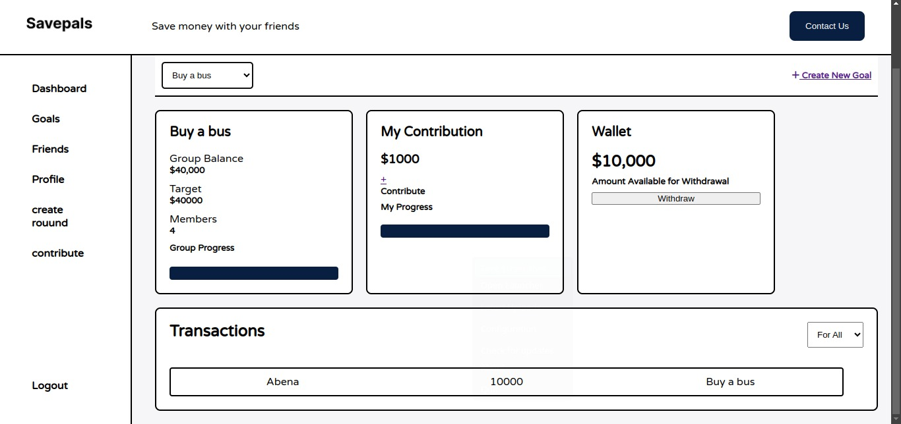
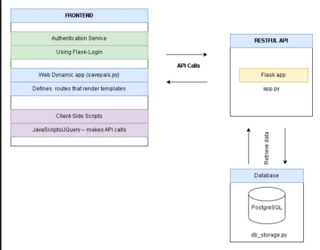

**SavePals**

This repository contains scripts that define the SavePals application. 

**Overview**

SavePals is a collaborative savings platform that allows friends to save money together by setting group goals, tracking progress, and managing contributions. Built with Flask, the application provhrefes a streamlined and user-friendly interface for managing group savings plans, making financial collaboration easier and more transparent.

**How it works**

This application comprises of two parts, the first is the API server that defines the endpoints used to access the data in the storage and the second part is the web_dynamic server that renders application templates. Using JQuery, API calls are made to the API server and data is populated in the templates.

**Table of Contents**

- <a href="#features">Features</a>
- <a href="#stack">Tech Stack</a>
- <a href="#install">Installation</a>
- <a href="#setup">Setup</a>
- <a href="test">Test</a>
- <a href="#api">API Endpoints</a>
- <a href="#contribute">Contributing</a>
- <a href="#licence">Licence</a>

<h2 id="features">Features</h2>

1. Create and Manage plans: Create savings plan with specific goals, track progress, and manage contributions.

2. Contribution Management: Easily contribute to group goals and see individual progress.

3. Plan Progress Visualization: View plan progress with dynamic progress bars and financial summaries.

4. User Authentication: Secure login and logout functionality.

5. Interactive Dashboard: A personalized dashboard displaying plan details, contribution options, and more.

6. Lists the friends within your plans, with details of their personal contact information.

<h2 id="stack">Tech Stack</h2>

1. Frontend: HTML, CSS, JavaScript (jQuery)

2. Backend: Flask (Python)

3. Database: PostgreSQL with SQLAlchemy ORM

4. Styling: CSS 

<h2 id="install">Installation</h2>

**Prerequisites**

- Python 3.12+
- PostgreSQL
- Virtualenv (recommended)

**Clone the Repository**

- go to your bash
- git clone https://github.com/luckys-lnz/savepals.git
- cd savepals
- Create a Virtual Environment 
   - go to your bash
   - python3 -m venv .venv
   - source .venv/bin/activate

**Install Backend Dependencies**

- go to your bash
- yay -S psql or sudo apt install psql or sudo pacman -S psql
- visit psql documentation page to set up the needed configurations

**Create a PostgreSQL database:**

- got your bash
- sudo -i -u postgres
- create database savepals_db
- Set up the database schema:

**Create a .env file in the project root with the following variables:** 

- SAVEPAL_POSTGRES_USER=savepals_dev
- SAVEPAL_POSTGRES_PWD=savepals_dev_pwd
- SAVEPAL_POSTGRES_HOST=localhost
- SAVEPAL_POSTGRES_DB=savepals_dev_db
- SAVEPAL_API_HOST=0.0.0.0
- SAVEPAL_API_PORT=5001
- SAVEPAL_ENV=development

**Running the Application**

*Activate the virtual environment:*

`source .venv/bin/activate`

*Start the api server:*

`python3 -m api.v1.app`

*Start the web_dynamic server:*

`python3 -m web_dynamic.savepals`

*Access the application:*

Open your browser and navigate to http://127.0.0.1:5000.

<h2 id="setup">Setup</h2>

**Database and User**

Create a PostgreSQL database and set up development and test users. Grant privilege to test and development users:

- go to the root folder of SavePals project

- For development create database savepals_dev_db, create new user savepals_dev  and add GRANT privilege to created user:

- ``
sudo -u postgres psql -f create_db_and_user_dev.sql
``

- For testing create database savepals_test_db, create new user savepals_test  and add GRANT privilege to created user:

- ``
sudo -u postgres psql -f create_db_and_user_test.sql
``

<h2 id="test">Test</h2>

**Test models and database storage**

- ``
cd SavePals
``
- open .env file with the editor of your choice

- replace ``SAVEPAL_ENV=development`` with ``SAVEPAL_ENV=test``

- replace ``SAVEPAL_POSTGRES_USER=savepals_dev`` with ``SAVEPAL_POSTGRES_USER=savepals_test``

- replace ``SAVEPAL_POSTGRES_PWD=savepals_dev_pwd`` with ``SAVEPAL_POSTGRES_PWD=savepals_test_pwd``

- Run command:

- ``
python3 -m unittest discover tests 2>&1 /dev/null | tail -n 1
``

<h2 id="api">API Endpoints</h2>

***Group Management**

*Get All Groups*

- URL: /api/v1/groups
- Method: GET
- Description: Retrieves a list of all groups.

*Create Group*

- URL: /api/v1/groups
- Method: POST
- Description: Creates a new group.

*Delete Group*

- URL: /api/v1/groups
- Method: DELETE
- Description: Deletes a new group.

*List users in a group*

- URL: /api/v1/groups/<group_id>/users
- Method: GET
- Description: list users in a group.

*List contributions rounds in a group*

- URL: /api/v1/groups/<group_id>/rounds
- Method: GET
- Description: list contribution rounds in a group.

*Update a group*

- URL: /api/v1/groups/<group_id>
- Method: PUT
- Description: Update a group.

*Add user to a group*

- URL: /api/v1/groups/<group_id>/users/<user_id>
- Method: POST
- Description: Add users to a group.

*Remove user from a group*

- URL: /api/v1/groups/<group_id>/users/<user_id>
- Method: DELETE
- Description: Remove user from a group.

*Add round to a group*

- URL: /api/v1/groups/<group_id>/rounds/<round_id>
- Method: POST
- Description: Add contribution round to a group.

*Remove round from a group*

- URL: /api/v1/groups/<group_id>/rounds/<round_id>
- Method: DELETE
- Description: Remove contribution round from a group.

*Add payout transaction to a group*

- URL: /api/v1/groups/<group_id>/payouts/<payout_id>
- Method: POST
- Description: Add payout transaction to a group

*Remove payout transaction from a group*

- URL: /api/v1/groups/<group_id>/payouts/<payout_id>
- Method: DELETE
- Description: Remove payout transaction to a group.

Add contribution transaction to a group*

- URL: /api/v1/groups/<group_id>/contributions/<contribution_id>
- Method: POST
- Description: Add contribution transaction to a group

Remove contribution transaction from a group*

- URL: /api/v1/groups/<group_id>/contributions/<contribution_id>
- Method: DELETE
- Description: Remove contribution transaction from a group

**User Management**

*Get all users*

- URL: /api/v1/users
- Method: GET
- Description: Retrieves a list of all users.

*Delete User*

- URL: /api/v1/groups
- Method: DELETE
- Description: Deletes a new user.

*List user groups*

- URL: /api/v1/users/<user_id>/groups
- Method: GET
- Description: Retrieves a list of all the groups a user is part of.

*Update a user*

- URL: /api/v1/users/<user_id>
- Method: PUT
- Description: Updates a user.

*Add payout transaction to a user*

- URL: /api/v1/users/<user_id>/payouts/<payout_id>
- Method: POST
- Description: Add payout transaction to a user.

*Remove payout transaction from a user*

- URL: /api/v1/users/<user_id>/payouts/<payout_id>
- Method: DELETE
- Description: Remove payout transaction to a user.

*Add contribution transaction to a user*

- URL: /api/v1/users/<user_id>/contributions/<contribution_id>
- Method: POST
- Description: Add contribution transaction to a user

*Remove contribution transaction from a user*

- URL: /api/v1/users/<user_id>/payouts/<payout_id>
- Method: DELETE
- Description: Remove contribution transaction from a user

**Transaction Management**

*Get contributions details*

- URL: /api/v1/transactions/contributions/<contribution_id>
- Method: GET
- Description: Retrieves details of the contribution transaction done by user.

*Get Payment details*

- URL: /api/v1//transactions/payments/<payment_id>
- Method: GET
- Description: Retrieves details of the payment transactions done by user.

*Get user transactions*

- URL: /api/v1/users/<user_id>/transactions
- Method: GET
- Description: List all transactions done by user.

*Get group transactions for user*

- URL: /api/v1/users/<user_id>/groups/<group_id>/transactions
- Method: GET
- Description: List all transactions of a user in a specified group.

*Get all transactions for a group*

- URL: /api/v1/groups/<group_id>/transactions
- Method: GET
- Description: List all transactions of a group.

*Get all transactions in a round contribution*

- URL: /api/v1/rounds/<round_id>/transactions
- Method: GET
- Description: List all transactions in a specified round contribution.

**Dashboard Management**

*Get group summary*

- URL: /api/v1/groups/<group_id>/summary
- Method: GET
- Description: Retrieves the group summary.

*Get round summary*

- URL: /api/v1/groups/<group_id>/rounds/<round_id>/summary
- Method: GET
- Description: Retrieves the round summary of a specified group.

**Round Management**

*List all contriibution rounds of a Groups*

- URL: /api/v1/groups/<group_id>/rounds
- Method: GET
- Description: Retrieves a list of all rounds in a group.

*Retrieve a round from a group*

- URL: /api/v1/groups/<group_id>/rounds/<round_id>
- Method: GET
- Description: Retrieves a round details from a group.

*Create a new round*

- URL: /api/v1/groups/<group_id>/rounds
- Method: POST
- Description: Creates a new round for a group.

*Updates a round*

- URL: /api/v1/groups/<group_id>/rounds/<round_id>
- Method: PUT
- Description: Updates a round in a group.

*Deletes a round*

- URL: /api/v1/groups/<group_id>/rounds/<round_id>
- Method: DELETE
- Description: Deletes a round from a group.

*Update a group*

- URL: /api/v1/groups/<group_id>
- Method: PUT
- Description: Update a group.

*Add payout transaction to a round*

- URL: /api/v1/rounds/<round_id>/payouts/<payout_id>
- Method: POST
- Description: Add payout transaction to a round

*Remove payout transaction from a round*

- URL: /api/v1/rounds/<round_id>/payouts/<payout_id>
- Method: DELETE
- Description: Remove payout transaction from a round.

*Add contribution transaction to a round*

- URL: /api/v1/rounds/<round_id>/contributions/<contribution_id>
- Method: POST
- Description: Add contribution transaction to a round

*Remove contribution transaction from a round*

- URL: /api/v1/rounds/<round_id>/contributions/<contribution_id>
- Method: DELETE
- Description: Remove contribution transaction from a round

**User Authentication**

*Signup user*

- URL: /api/v1/signup
- Method: POST
- Description: Signup a user.

*Login user*
- URL: /api/v1/login
- Method: POST
- Description: Authenticates a user and starts a session.

*Logout user*
- URL: /api/v1/logout
- Method: POST
- Description: Logs out the user and ends the session.

<h2 id="contribute">Contributing</h2>

**We welcome contributions! To contribute:**

1. Fork the repository.
2. Create a new branch (git checkout -b feature/your-feature-name).
3. Make your changes and commit (git commit -m 'Add feature').
4. Push to the branch (git push origin feature/your-feature-name).
Open a pull request.
4. Code Style
Follow PEP 8 for Python code. Ensure that your code is properly formatted and linted.

<h2 id="licence">License</h2>
This project is licensed under the MIT License - see the LICENSE file for details.

Custom License

Copyright (c) 2024 
- Lucky Archibong, 
- Deantosh Daiddoh, 
- Benedict Abudu

Permission to Contribute: Permission is hereby granted to any person or organization to contribute to this project by submitting code, suggestions, or documentation. Contributions are welcome, but must be submitted via pull request and are subject to review and approval by the project maintainer.

<h4>Restrictions on Use:</h4>

<h5>No Redistribution:</h5> You are not permitted to publish, distribute, sublicense, or sell any portion of this software, its concepts, or any derivative works without explicit, written permission from the copyright holder.

<h5>No Public Use:</h5> The project, its code, and any associated ideas are personal intellectual property and may not be shared publicly, used in commercial or non-commercial contexts, or presented as your own work.

<h5>No Modification for Personal Use:</h5> Modifying, creating derivative works, or using any part of this project for personal or external projects is strictly prohibited.

<h5>Disclaimer:</h5> The software is provided "as is," without warranty of any kind, express or implied, including but not limited to the warranties of merchantability, fitness for a particular purpose, and noninfringement. In no event shall the author or copyright holder be liable for any claim, damages, or other liability, whether in an action of contract, tort, or otherwise, arising from, out of, or in connection with the software or the use or other dealings in the software